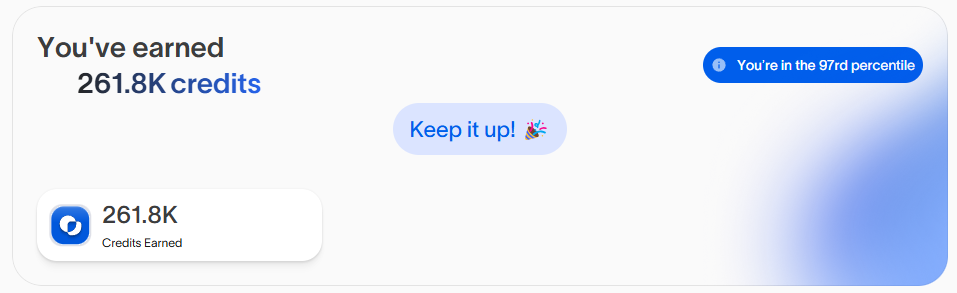

# OASIS AI BETA CLI VERSION


AI inference powered by distributed compute

# Features



- **Register/Login Accounts**

- **Auto Create Providers**

- **Auto Send Heartbeat**

- **Support Multy Accounts**

- **Support Proxy**

## Requirements

- **Node.js**: Ensure you have Node.js installed.

- **NPM**: Ensure you have npm installed.

put your proxy in file `proxy.txt` format `http://username:pass@ip:port` 
recommended use static proxy...

## Setup

1. Clone this repository:

   ```bash
   git clone https://github.com/Zlkcyber/oasis-bot.git
   cd oasis-bot
   ```

2. Install dependencies:

   ```bash
   npm install
   ```

3. put your email and pass to `accounts.txt` format `email|password` 1 account for 1 line

   ```bash
   nano accounts.txt
   ```

4. put your proxy to `proxy.txt`

   ```bash
   nano proxy.txt
   ```

5. Setup to create accounts/login and get Tokens:

   ```bash
   npm run setup
   ```

6. Run The Script:

   ```bash
   npm run start
   ```


## 

This project is licensed under the [MIT License](LICENSE).